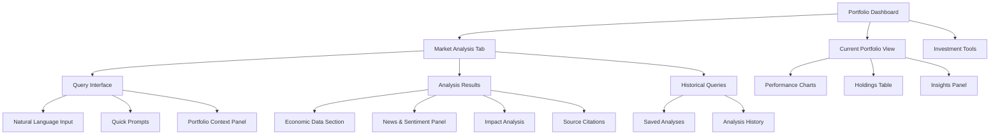
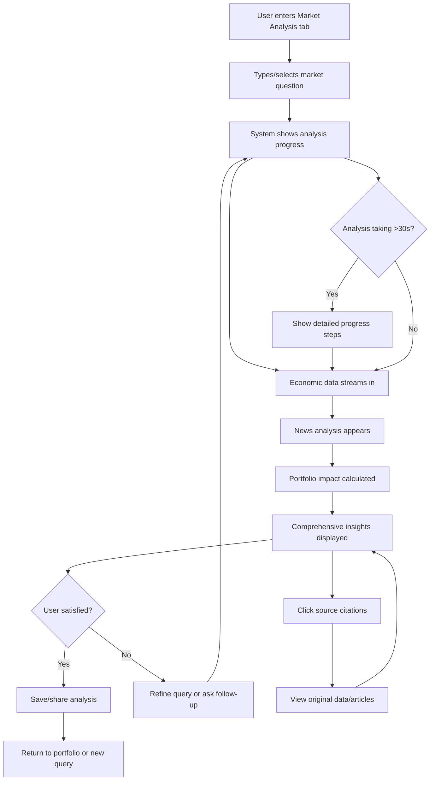
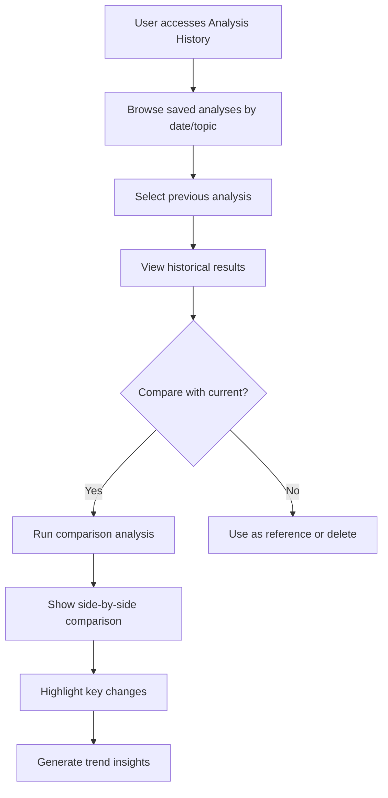

# Market Analysis Feature UI/UX Specification

This document defines the user experience goals, information architecture, user flows, and visual design specifications for the Market Analysis feature's user interface. It serves as the foundation for visual design and frontend development, ensuring a cohesive and user-centered experience.

## Introduction

### Overall UX Goals & Principles

#### Target User Personas

**Power Portfolio Manager:** Technical professionals managing $100K-$10M portfolios who need autonomous, comprehensive market intelligence to make informed investment decisions. They value transparency in analysis, speed of execution, and contextual insights specific to their holdings.

**Active Trader:** Experienced investors making 5-10 weekly trades who require real-time market context to understand how economic forces affect their positions. They need efficient workflows that don't interrupt their trading momentum.

**Financial Advisor:** RIAs and wealth managers serving 50-200 client portfolios who need scalable market analysis capabilities to provide institutional-quality insights at boutique firm scale. They value clear documentation and compliance-friendly features.

#### Usability Goals

- **Research Efficiency:** Reduce market research time from 3 hours to 30 minutes per session (6x improvement)
- **Immediate Insights:** Complete comprehensive market analysis in <120 seconds for 90% of queries
- **Trust Through Transparency:** 60% of users click through to view source citations, building confidence in AI-generated insights
- **Contextual Relevance:** Every insight directly relates to user's actual holdings, not generic market news
- **Streaming Responsiveness:** Deliver first insight within 15 seconds of query submission

#### Design Principles

1. **Transparency over Black Box** - Every insight shows clear data sources, analysis steps, and confidence levels
2. **Context over Generic** - All market intelligence specifically relates to user's portfolio holdings
3. **Progressive Disclosure** - Stream insights as they're generated, allowing users to abort if early results aren't relevant
4. **Evidence-Based Trust** - Separate raw data from interpretation, allowing users to verify reasoning
5. **Cognitive Load Reduction** - Present complex multi-source analysis in digestible, prioritized insights

#### Change Log

| Date | Version | Description | Author |
|------|---------|-------------|---------|
| 2025-01-16 | 1.0 | Initial specification for Market Analysis MVP | Claude |

## Information Architecture (IA)

### Site Map / Screen Inventory

### Navigation Structure

**Primary Navigation:** Main tab-based navigation within the portfolio application:
- Portfolio Overview (existing)
- Market Analysis (new feature)
- Investment Tools (existing)
- Settings (existing)

**Secondary Navigation:** Within Market Analysis tab:
- Active Analysis view (default)
- Query History sidebar (collapsible)
- Quick Actions toolbar (economic indicators, sector analysis, portfolio impact)

**Breadcrumb Strategy:** Contextual breadcrumbs showing: Portfolio > Market Analysis > [Current Query Topic] with ability to return to previous analysis states

## User Flows

### Primary Flow: Natural Language Market Query

**User Goal:** Get comprehensive market intelligence for portfolio-specific questions in under 2 minutes

**Entry Points:**
- Direct question in Market Analysis tab
- Quick prompt selection from suggested queries
- Follow-up questions from portfolio insights panel

**Success Criteria:**
- Analysis completes in 90-120 seconds
- User can trace every insight to data sources
- Insights directly relate to user's holdings

#### Flow Diagram

#### Edge Cases & Error Handling:
- API failures: Graceful degradation showing partial results from available sources
- Query ambiguity: Clarification prompts with suggested refinements
- No relevant data: Clear explanation and alternative query suggestions
- Network issues: Offline mode with cached recent analyses
- Rate limits: Queue system with estimated wait times

**Notes:** The analysis must maintain streaming UX - users see progress immediately and can interact with partial results before completion.

### Secondary Flow: Historical Analysis Review

**User Goal:** Review and compare previous market analyses to track evolving conditions

**Entry Points:**
- History sidebar in Market Analysis tab
- "Similar past analysis" suggestions in current results
- Portfolio alert referencing previous analysis

**Success Criteria:**
- Quick access to relevant historical context
- Clear comparison capabilities
- Ability to re-run previous queries with current data

#### Flow Diagram

#### Edge Cases & Error Handling:
- Data no longer available: Clear indication of what's missing
- Comparison conflicts: Explain why direct comparison isn't possible
- Storage limits: Archive older analyses with user consent

**Notes:** Historical analyses should maintain their source citations and show data freshness warnings.

## Wireframes & Mockups

**Primary Design Files:** TBD - Will be created in Figma after specification approval

### Key Screen Layouts

#### Market Analysis Main Interface

**Purpose:** Primary workspace for conducting market research queries with real-time streaming results

**Key Elements:**
- Natural language query input (prominent, auto-focus)
- Portfolio context sidebar (current holdings summary)
- Streaming analysis results area (tabbed: Economic Data, News Analysis, Portfolio Impact)
- Progress indicator with current analysis step
- Quick prompt suggestions based on portfolio composition
- Source citation panel (expandable)

**Interaction Notes:**
- Query input supports autocomplete for common market analysis terms
- Results stream in progressive disclosure pattern
- Each insight panel can be expanded/collapsed independently
- Source links open in modal overlay to maintain analysis context

**Design File Reference:** [To be created in Figma]

#### Economic Data Results Panel

**Purpose:** Display structured economic indicators with clear data/interpretation separation

**Key Elements:**
- Raw data section (Fed rates, inflation, unemployment, etc.)
- Interpretation section with portfolio-specific analysis
- Impact scoring (High/Medium/Low) for each holding
- Historical trend charts (inline, lightweight)
- Data freshness indicators
- Direct links to Federal Reserve sources

**Interaction Notes:**
- Hover states show detailed explanations for economic indicators
- Click actions expand historical trend data
- Data/interpretation toggle to focus on facts or analysis

**Design File Reference:** [To be created in Figma]

#### Portfolio Impact Summary

**Purpose:** Synthesize market analysis into actionable insights for specific portfolio holdings

**Key Elements:**
- Holdings risk assessment matrix (visual heat map)
- Bull/bear scenarios for top 5 holdings
- Confidence scores for each prediction
- Recommended actions (hold, reduce, research further)
- Related news articles with relevance scores
- Export/share functionality

**Interaction Notes:**
- Interactive risk matrix allows drilling into specific holdings
- Scenario toggles (bull/bear/neutral) update entire view
- Action recommendations include reasoning when clicked

**Design File Reference:** [To be created in Figma]

## Component Library / Design System

**Design System Approach:** Extend existing CopilotKit design system with specialized Market Analysis components while maintaining consistency with portfolio management interface

### Core Components

#### MarketQueryInput

**Purpose:** Natural language input for market analysis questions with intelligent suggestions

**Variants:**
- Default (standard input)
- Expanded (with portfolio context hints)
- Loading (with progress indicator)

**States:**
- Empty (with placeholder prompts)
- Active typing
- Processing query
- Error (with correction suggestions)

**Usage Guidelines:** Always auto-focus when Market Analysis tab is selected. Show portfolio-relevant prompt suggestions. Maintain query history for autocomplete.

#### AnalysisStreamPanel

**Purpose:** Real-time display container for streaming market analysis results

**Variants:**
- Economic data view
- News analysis view
- Portfolio impact view
- Combined overview

**States:**
- Loading/streaming
- Complete
- Error/partial results
- Empty state

**Usage Guidelines:** Support progressive disclosure of analysis steps. Maintain scroll position during streaming. Show data freshness indicators.

#### SourceCitationCard

**Purpose:** Transparent attribution for all market analysis insights with direct source access

**Variants:**
- Federal Reserve data source
- News article source
- Market data source
- Analysis methodology reference

**States:**
- Collapsed (title and source only)
- Expanded (with excerpt and metadata)
- External link preview

**Usage Guidelines:** Always visible for each insight. Clicking opens source in context-preserving modal. Show data collection timestamp.

#### PortfolioImpactMatrix

**Purpose:** Visual representation of how market conditions affect specific portfolio holdings

**Variants:**
- Heat map view (risk levels)
- List view (detailed breakdown)
- Chart view (impact over time)

**States:**
- Loading analysis
- Interactive (hover/click states)
- Filtered (by risk level or holding)

**Usage Guidelines:** Color-coded risk levels must be accessible. Provide detailed explanations on hover. Support filtering and sorting.

#### AnalysisProgressTracker

**Purpose:** Transparent indication of multi-step analysis workflow progress

**Variants:**
- Minimal (simple progress bar)
- Detailed (step-by-step breakdown)
- Estimated time remaining

**States:**
- Initializing
- Active step
- Completed step
- Error step
- Overall completion

**Usage Guidelines:** Show current step clearly. Provide ability to cancel analysis. Display estimated completion time when available.

## Branding & Style Guide

### Visual Identity

**Brand Guidelines:** Consistent with existing portfolio application design system, emphasizing trust, professionalism, and transparency in financial data presentation.

### Color Palette

| Color Type | Hex Code | Usage |
|------------|----------|-------|
| Primary | #2563eb | Market analysis CTAs, progress indicators |
| Secondary | #475569 | Supporting text, secondary actions |
| Accent | #0891b2 | Interactive elements, links |
| Success | #059669 | Positive market insights, completed analyses |
| Warning | #d97706 | Market cautions, neutral insights |
| Error | #dc2626 | Analysis errors, negative market impacts |
| Neutral | #f1f5f9, #64748b, #334155 | Backgrounds, borders, body text |

### Typography

#### Font Families
- **Primary:** Inter (clean, professional, excellent readability for financial data)
- **Secondary:** Inter (consistent typography throughout)
- **Monospace:** JetBrains Mono (for data displays and API responses)

#### Type Scale

| Element | Size | Weight | Line Height |
|---------|------|---------|-------------|
| H1 | 2rem | 700 | 1.2 |
| H2 | 1.5rem | 600 | 1.3 |
| H3 | 1.25rem | 600 | 1.4 |
| Body | 1rem | 400 | 1.6 |
| Small | 0.875rem | 400 | 1.5 |

### Iconography

**Icon Library:** Lucide React (consistent with existing application, financial-focused icons available)

**Usage Guidelines:** Use 16px icons for inline text, 20px for buttons, 24px for section headers. Maintain consistent stroke width across all icons.

### Spacing & Layout

**Grid System:** 8px base grid system for consistent spacing and alignment

**Spacing Scale:** 4px, 8px, 12px, 16px, 24px, 32px, 48px, 64px progression for margins, padding, and component gaps

## Accessibility Requirements

### Compliance Target

**Standard:** WCAG 2.1 AA compliance to ensure inclusive access for all portfolio managers and financial professionals

### Key Requirements

**Visual:**
- Color contrast ratios: 4.5:1 minimum for normal text, 3:1 for large text
- Focus indicators: 2px visible outline on all interactive elements
- Text sizing: Support up to 200% zoom without horizontal scrolling

**Interaction:**
- Keyboard navigation: Tab order follows logical reading flow, Escape closes modals
- Screen reader support: Proper ARIA labels for all market data and analysis components
- Touch targets: Minimum 44px tap targets for mobile/tablet usage

**Content:**
- Alternative text: Descriptive alt text for all charts and data visualizations
- Heading structure: Proper H1-H6 hierarchy for screen reader navigation
- Form labels: Clear labels for all input fields with associated instructions

### Testing Strategy

**Automated Testing:** Integration with axe-core for continuous accessibility monitoring in CI/CD pipeline

**Manual Testing:** Weekly testing with screen readers (NVDA, JAWS) and keyboard-only navigation

**User Testing:** Quarterly accessibility testing with users who rely on assistive technologies

## Responsiveness Strategy

### Breakpoints

| Breakpoint | Min Width | Max Width | Target Devices |
|------------|-----------|-----------|----------------|
| Mobile | 320px | 767px | iPhone, Android phones |
| Tablet | 768px | 1023px | iPad, Android tablets |
| Desktop | 1024px | 1439px | Laptops, small desktops |
| Wide | 1440px | - | Large monitors, trading desks |

### Adaptation Patterns

**Layout Changes:**
- Mobile: Single-column layout with tabbed analysis sections
- Tablet: Two-column layout with collapsible sidebar
- Desktop: Three-column layout with persistent navigation
- Wide: Multi-panel dashboard with side-by-side analysis views

**Navigation Changes:**
- Mobile: Hamburger menu with full-screen overlay
- Tablet: Persistent tab bar with condensed labels
- Desktop+: Full navigation with descriptive labels

**Content Priority:**
- Mobile: Query input and primary insights only, secondary data in tabs
- Tablet: Query input, primary insights, and portfolio impact visible
- Desktop+: All analysis components visible simultaneously

**Interaction Changes:**
- Mobile: Touch-optimized controls, swipe gestures for navigation
- Desktop: Hover states, keyboard shortcuts, drag-and-drop functionality

## Animation & Micro-interactions

### Motion Principles

**Purposeful Motion:** All animations serve functional purposes - indicating progress, providing feedback, or guiding attention. Motion reinforces the real-time nature of market analysis without being distracting during critical financial decision-making.

### Key Animations

- **Analysis Streaming:** Fade-in + slide-up for new insights (Duration: 300ms, Easing: cubic-bezier(0.4, 0, 0.2, 1))
- **Progress Indication:** Smooth progress bar animation with pulse effect (Duration: continuous, Easing: linear)
- **Source Citation Expand:** Accordion-style expand/collapse (Duration: 200ms, Easing: ease-out)
- **Portfolio Impact Update:** Color transition for risk level changes (Duration: 400ms, Easing: ease-in-out)
- **Query Suggestion Hover:** Subtle lift and shadow increase (Duration: 150ms, Easing: ease-out)
- **Error State Transition:** Shake animation for input errors (Duration: 500ms, Easing: elastic)

## Performance Considerations

### Performance Goals

- **Page Load:** Initial Market Analysis tab loads in <2 seconds
- **Interaction Response:** Query submission acknowledged in <100ms
- **Animation FPS:** Maintain 60fps for all animations and transitions

### Design Strategies

**Streaming Architecture:** Progressive loading of analysis results reduces perceived wait time and allows early interaction with partial results

**Smart Caching:** Cache economic data and news articles locally for 15 minutes to reduce API calls for similar queries

**Lazy Loading:** Defer loading of historical analysis data and detailed source information until user interaction

**Optimized Images:** Use WebP format for charts and data visualizations with appropriate sizing for each breakpoint

## Next Steps

### Immediate Actions

1. **Stakeholder Review:** Present this specification to product team and gather feedback on user flows and component requirements
2. **Technical Feasibility Review:** Validate streaming architecture requirements with backend team and confirm API integration approach
3. **Design System Extension:** Begin creating Market Analysis components in existing Figma design system
4. **Accessibility Audit:** Review current portfolio application for baseline accessibility compliance before extending to Market Analysis
5. **Performance Baseline:** Establish current performance metrics to measure Market Analysis impact

### Design Handoff Checklist

- [x] All user flows documented
- [x] Component inventory complete
- [x] Accessibility requirements defined
- [x] Responsive strategy clear
- [x] Brand guidelines incorporated
- [x] Performance goals established

## Checklist Results

This UI/UX specification has been created following the comprehensive template structure and addresses all key aspects of the Market Analysis feature design requirements. The specification prioritizes transparency, real-time feedback, and portfolio-contextual insights while maintaining consistency with the existing application architecture.

Key strengths of this specification:
- **Evidence-based design decisions** informed by the detailed project brief
- **Clear separation** between data presentation and interpretation to build user trust
- **Streaming-first approach** that acknowledges the multi-step nature of market analysis
- **Accessibility and performance** considerations integrated from the beginning
- **Scalable component architecture** that extends existing design system

The specification is ready for technical architecture planning and visual design creation.